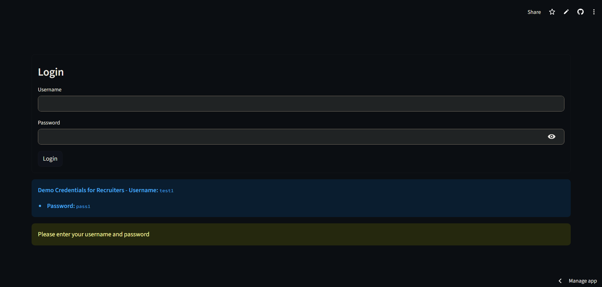
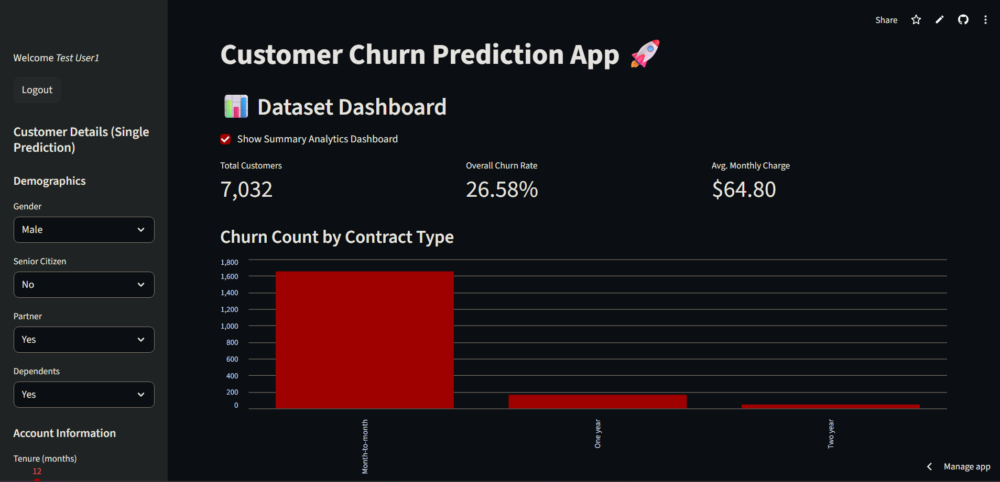
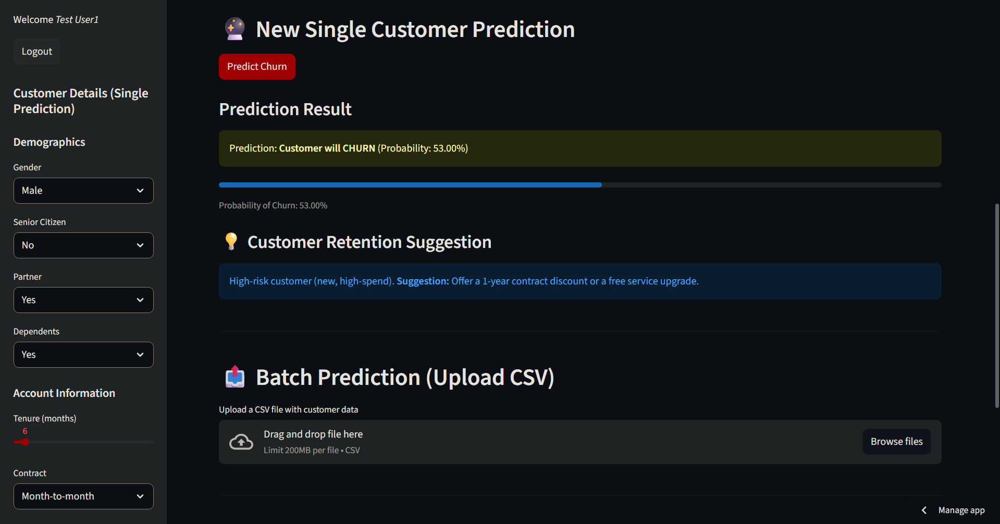
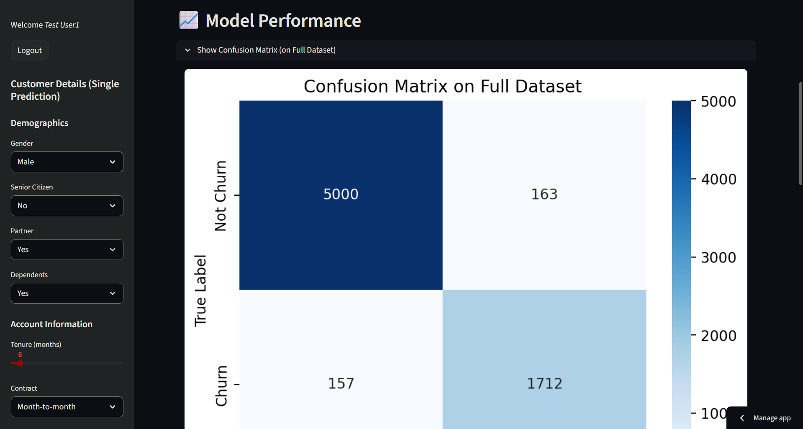
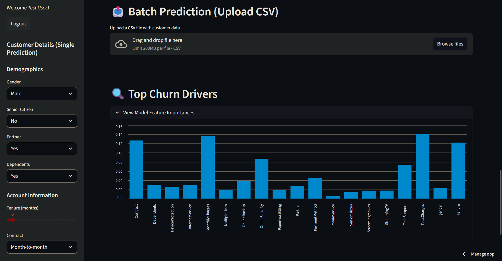
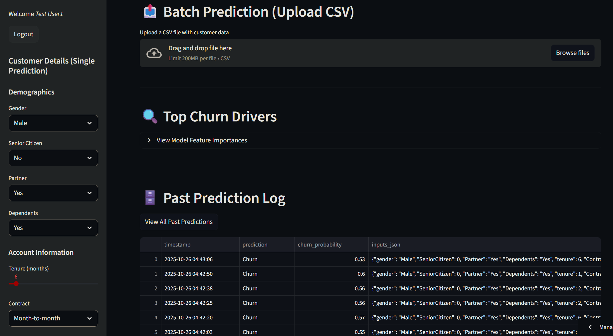

# End-to-End Customer Churn Prediction App

This is a complete, end-to-end Machine Learning web application that predicts customer churn. The app is built with Streamlit and includes a full-stack experience, from a secure user login to a live dashboard, model explainability, and a database for logging predictions.

[](https://churn-prediction-app-h4qy5h5ipw2cvrxlpykkfe.streamlit.app/)

### 🚀 [**Click Here for the Live Demo**](https://churn-prediction-app-h4qy5h5ipw2cvrxlpykkfe.streamlit.app/)

---

## Overview

This project was built to demonstrate a full-cycle data science project, moving from a raw dataset to a deployed, secure, and interactive web application. The model (a RandomForest/XGBoost classifier) is trained on the [Telco Customer Churn dataset](https://www.kaggle.com/datasets/blastchar/telco-customer-churn) to predict whether a customer will churn (leave the service) or not.

The app is "gated" with a secure login, but for portfolio review purposes, demo credentials are provided on the login page.

## ✨ Key Features

* **Secure Authentication:** Full login/logout system using `streamlit-authenticator` with hashed passwords.
* **Recruiter-Friendly Login:** A special info box on the login page provides demo credentials for easy review.
* **KPI Dashboard:** A summary dashboard shows key business metrics:
    * Total Customers
    * Overall Churn Rate (%)
    * Average Monthly Charges
* **Data Visualization:** An interactive bar chart showing churn counts by contract type.
* **Real-time Prediction:** A sidebar form allows for entering a single customer's details to get an instant churn prediction.
* **Actionable Retention Insights:** The app provides rule-based retention suggestions based on the prediction (e.g., "Offer a 1-year contract discount").
* **Model Explainability (XAI):** An expandable section shows the global feature importances from the model, identifying the top drivers of churn (e.g., `Contract`, `tenure`).
* **Model Performance:** A confusion matrix is displayed to show the model's performance on the full dataset.
* **Batch Prediction:** Users can upload a CSV file of multiple customers to get batch predictions, with a link to download the results.
* **Prediction Logging:** Every prediction is logged with a timestamp to a **SQLite database** (`predictions.db`).
* **Audit Trail:** A "View Past Predictions" button retrieves and displays all historical predictions from the database.

## 🚀 Demo & Screenshots

Here is a walk-through of the application's features.

**1. Secure Login (with Demo Credentials)**


**2. Main Analytics Dashboard**


**3. Single Prediction & Retention Suggestion**


**4. Confusion Matrix**


**5. Top Churn Drivers**


**6. Advanced Features (Batch Upload & Prediction Log)**


---

## 🛠️ Tech Stack

* **Python:** Core programming language.
* **Streamlit:** For building the interactive web UI.
* **Pandas:** For data manipulation and processing.
* **Scikit-learn / XGBoost:** For the machine learning model.
* **streamlit-authenticator:** For the secure login system.
* **SQLite:** For the prediction logging database.
* **Seaborn / Matplotlib:** For data visualizations (Confusion Matrix, Bar Chart).

---

## ⚙️ Running Locally

To run this project on your own machine, follow these steps:

**1. Clone the Repository:**
```bash
git clone https://github.com/Nikhil-Singh2745/churn-prediction-app
````

**2. Create a Virtual Environment:**

```bash
# For macOS/Linux
python3 -m venv venv
source venv/bin/activate

# For Windows
python -m venv venv
.\venv\Scripts\activate
```

**3. Install Dependencies:**

```bash
pip install -r requirements.txt
```

**4. Set Up Local Secrets:**
Streamlit's new best practice is to use a local secrets file. This app is configured to run with it.

  * Create a new folder in the root directory: `.streamlit`
  * Inside that folder, create a new file: `secrets.toml`
  * Copy and paste the template below into `secrets.toml` and add your *own* credentials (you can use your `config.yaml` as a reference).

<!-- end list -->

```toml
# .streamlit/secrets.toml
# This file is used for LOCAL development

[credentials.usernames.jsmith]
username = "jsmith"
email = "jsmith@gmail.com"
name = "John Smith"
password = "$2b$12$....YOUR....HASHED....PASSWORD...."

[credentials.usernames.rdoe]
username = "rdoe"
email = "rdoe@gmail.com"
name = "Rebecca Doe"
password = "$2b$12$....YOUR....OTHER....HASHED....PASSWORD...."

[cookie]
expiry_days = 30
key = "some_random_key_123"
name = "some_random_cookie_456"
```

**5. Run the App:**

```bash
streamlit run app.py
```

## ☁️ Deployment

This application is securely deployed on **Streamlit Cloud**.

  * The `config.yaml` and `predictions.db` files are included in `.gitignore` and are not on this repository.
  * All credentials and keys are securely managed using Streamlit's built-in Secrets management system, which are then read by `st.secrets` in the `app.py` file.

<!-- end list -->

```
```
